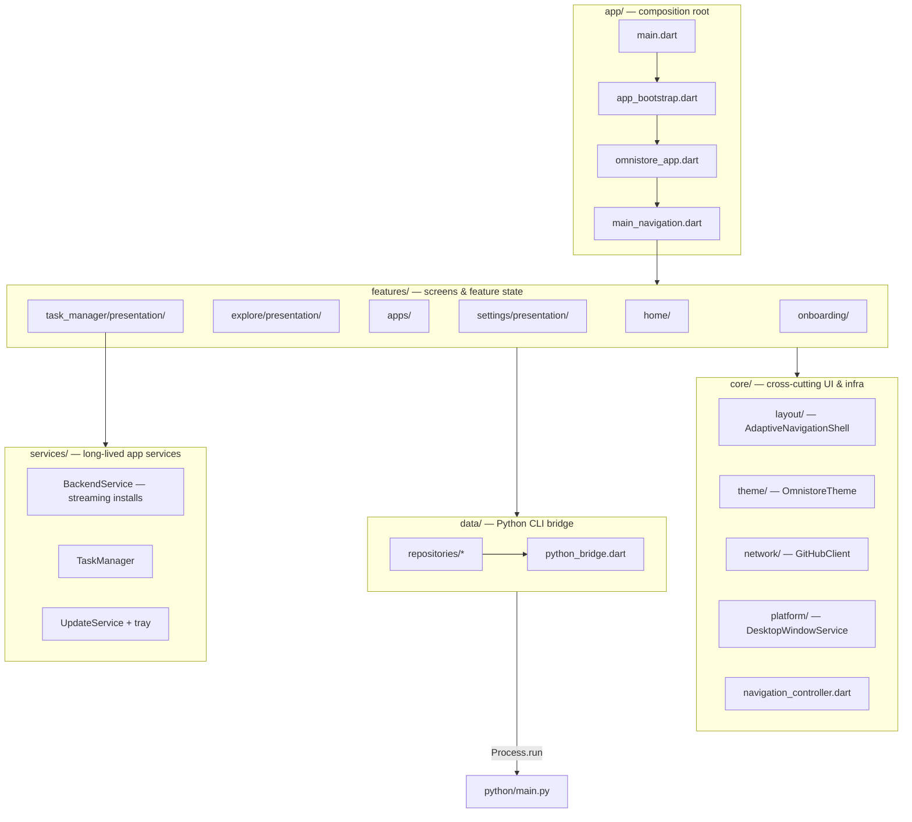

# FlutterUI Architecture

OmniStore’s UI is a **layered, feature-first** Flutter app. Read this before adding files.

## Layer diagram

## Directory map

| Path | Role | Depends on |
|------|------|------------|
| `lib/main.dart` | Entry: calls `bootstrapOmniStore()` | `app/` |
| `lib/app/` | DI providers, `MaterialApp`, root navigation | `core/`, `features/`, `data/` |
| `lib/features/` | User-facing modules (presentation + controllers) | `data/`, `core/`, `widgets/` |
| `lib/core/` | Theme, layout, GitHub HTTP, desktop window | Flutter SDK, packages |
| `lib/data/` | **Flutter-side** repositories spawning Python CLI | `python/` (repo root) |
| `lib/services/` | Streaming tasks, tray, categories (legacy bridge) | `data/`, `models/` |
| `lib/models/` | `AppPackage`, `TaskState`, sources | — |
| `lib/widgets/` | Shared UI (stars, title bar, progress) | `core/` |
| `lib/l10n/` | Generated localizations | — |

> **Naming:** `lib/data/` is **not** the Python backend. Python lives in `/python`. `lib/data/repositories/` are thin CLI adapters.

## Feature modules

| Feature | Path | Main types |
|---------|------|------------|
| Explore | `features/explore/presentation/` | `BrowseController`, store/search/category/details pages |
| Home | `features/home/` | `HomePage` (recommendations shelf) |
| Apps | `features/apps/` | `AppsPage` (installed) |
| Settings | `features/settings/presentation/` | `SettingsController`, `TweaksPage` |
| Tasks | `features/task_manager/presentation/` | `TaskController`, `DownloadPage` |
| Onboarding | `features/onboarding/` | `WelcomePage` |

## Navigation indices (`NavigationController`)

| Index | Page |
|-------|------|
| 0 | Home / Explore |
| 1 | Category |
| 2 | Search |
| 3 | Settings (`TweaksPage`) |
| 4 | Downloads |
| 5 | Installed apps |
| 6 | GitHub store |
| 7 | Flatpak store |

## Responsive shell

- **Width &lt; 600px:** `NavigationBar` + `PopScope` (Android-style).
- **Width ≥ 600px:** `NavigationRail` + optional `WindowTitleBar` (desktop).
- Breakpoints: `core/layout/breakpoints.dart`.

## Where to put new code

1. **New screen** → `features/<name>/presentation/pages/`
2. **Feature state** → `features/<name>/presentation/controllers/`
3. **New Python CLI command** → `data/repositories/` + `python/main.py`
4. **Shared UI** → `widgets/` or `core/` if app-wide
5. **External HTTP (non-Python)** → `core/network/`

## Related docs

- Repo-wide: [`../project_architecture.md`](../project_architecture.md)
- Per-layer READMEs under `lib/*/README.md`
