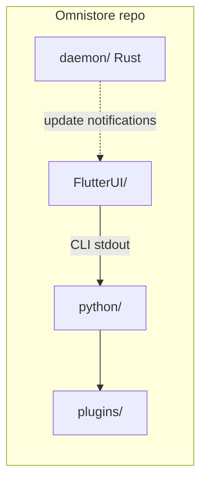
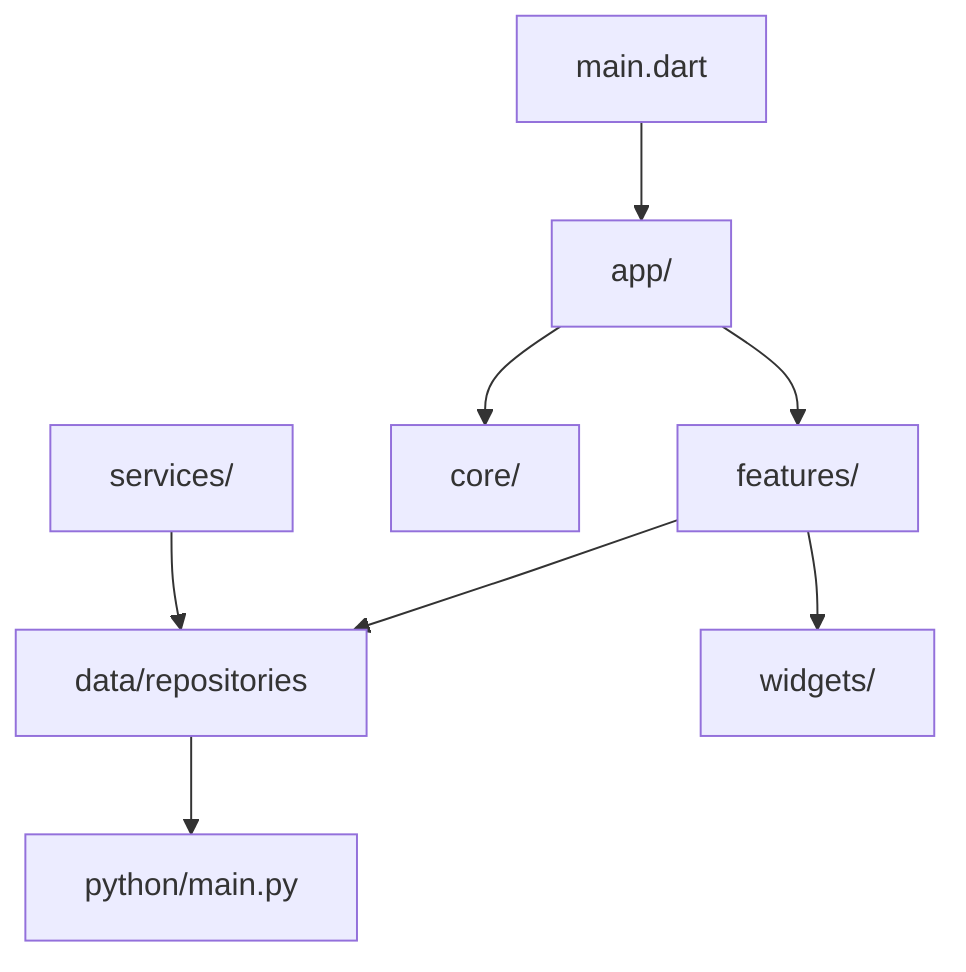
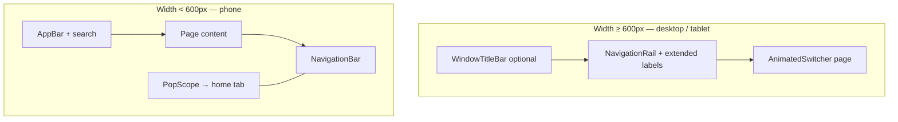
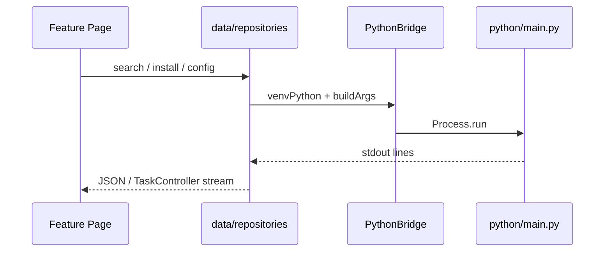

# OmniStore Project Architecture

> **Maintain this file** when you change repo layout, navigation, or cross-process protocols.  
> Flutter details: [`FlutterUI/ARCHITECTURE.md`](FlutterUI/ARCHITECTURE.md)

---

## 1. Repository overview

| Directory | Technology | Responsibility |
|-----------|------------|----------------|
| `FlutterUI/` | Dart / Flutter | MD3 UI, navigation, tray, GitHub stars (HTTP) |
| `python/` | Python | Package search/install, sources, AI CLI |
| `daemon/` | Rust | Background update checks, desktop notifications |
| `plugins/` | Python | Userdropped `UnifiedSource` plugins |

---

## 2. FlutterUI layout (current)

### 2.1 Layered `lib/`

| Layer | Path | Notes |
|-------|------|-------|
| Entry | `lib/main.dart` | Calls `bootstrapOmniStore()` only |
| App shell | `lib/app/` | Providers, `MaterialApp`, `MainNavigationEntry` |
| Features | `lib/features/` | Feature-first `presentation/pages` + `controllers` |
| Core | `lib/core/` | Theme, adaptive shell, GitHub client, desktop window |
| Data bridge | `lib/data/` | **`PythonBridge` + repositories** (not `python/`) |
| Services | `lib/services/` | `BackendService`, `TaskManager`, `UpdateService` |

**Renamed (clarity):** `lib/backend/` → `lib/data/`, `BackendConstants` → `PythonBridge`.

### 2.2 Feature modules

| Module | Location | Screens |
|--------|----------|---------|
| Home | `features/home/` | Explore landing |
| Explore | `features/explore/presentation/` | Category, Search, Details, GitHub/Flatpak stores |
| Apps | `features/apps/` | Installed list |
| Settings | `features/settings/presentation/` | `TweaksPage`, `SettingsController` |
| Task manager | `features/task_manager/presentation/` | Downloads, `TaskController` |
| Onboarding | `features/onboarding/` | `WelcomePage` |

### 2.3 UI shell (responsive)

- Implementation: `core/layout/adaptive_navigation_shell.dart`
- State: `core/navigation_controller.dart` (tab indices 0–7, see `FlutterUI/ARCHITECTURE.md`)
- Desktop: `core/platform/desktop_window_service.dart` — min size 900×640, tray minimize, hidden title bar
- GitHub stars: `core/network/github_client.dart` + `widgets/github_star_badge.dart`

---

## 3. Python backend (`python/`)

- **Entry:** `python/main.py` — CLI router, JSON/`[PROGRESS]` streams to Flutter
- **`sources/`:** Pacman, AUR, Flatpak, AppImage, GitHub, plugins (`UnifiedSource`)
- **`core/`:** e.g. `recommendation_manager.py` (Flathub + cache)
- **`ai/`:** Ollama, Gemini, OpenAI-compatible providers
- **`downloader/`:** Delegates to source implementations

Flutter invokes via `data/repositories/*` → `PythonBridge.venvPython` + `buildArgs()`.

---

## 4. Rust daemon (`daemon/`)

Lightweight service: periodic update checks and system notifications. Stopped on full app exit (`pkill omnistore-daemon` in `MainNavigationEntry`).

---

## 5. Integration flow

1. **Dev:** `python/.venv/bin/python` + `python/main.py`
2. **Release:** `backends/python_server` next to Flutter binary
3. **Streaming:** `[PROGRESS]`, `[SPEED]`, `[CALLBACK]` parsed in `BackendService` / `TaskManager`
4. **Tray:** `UpdateService` + `system_tray`; close → hide or full exit

---

## 6. Stream protocol (Python → Flutter)

| Token | Meaning |
|-------|---------|
| `[PROGRESS] <int>` | 0–100 progress; `-1` indeterminate |
| `[SPEED] <string>` | Download speed label |
| `[CALLBACK] <json>` | Terminal log `{type, message, level}` |

---

## 7. Plugins

Drop `.py` plugins under `plugins/` subclassing `UnifiedSource` — auto-registered in search/install pipeline.

---

## 8. Build (`auto_build.py`)

- Rust → `omnistore-daemon`
- PyInstaller → `python_server` in `backends/`
- Flutter release bundle
- `python auto_build.py --all`

---

## 9. UX pillars (summary)

1. Onboarding — `WelcomePage`, first-run config  
2. Navigation — adaptive shell, fluid `AnimatedSwitcher`  
3. Discovery — shelves, Hero banners, empty states  
4. Lifecycle — `TaskManager`, terminal dialog  
5. Configuration — grouped settings, stable text controllers  
6. AI — `MagicPulseIcon`, `isAIEnabled` gate  
7. Resilience — timeouts, stale GitHub cache, no red-screen on network errors  

---

## 10. Changelog (architecture)

| Date | Change |
|------|--------|
| 2026-06 | Feature-first `features/explore/presentation/`; removed `package_browse/` |
| 2026-06 | `lib/backend/` → `lib/data/`; `PythonBridge`; `lib/app/` shell split |
| 2026-06 | `AdaptiveNavigationShell`, `GitHubClient`, `OmnistoreTheme` |
