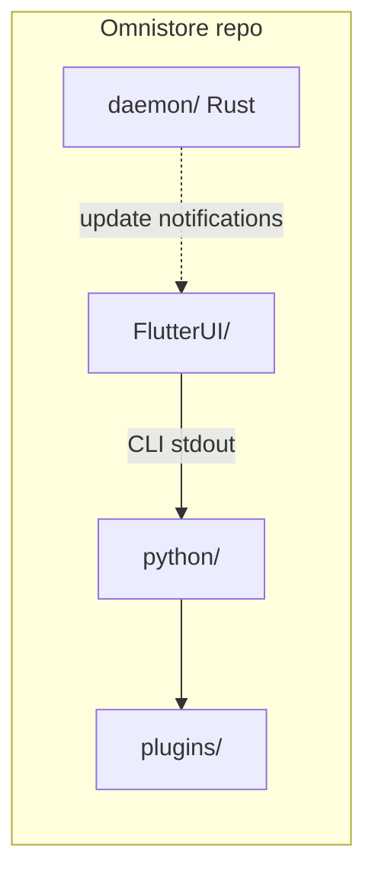
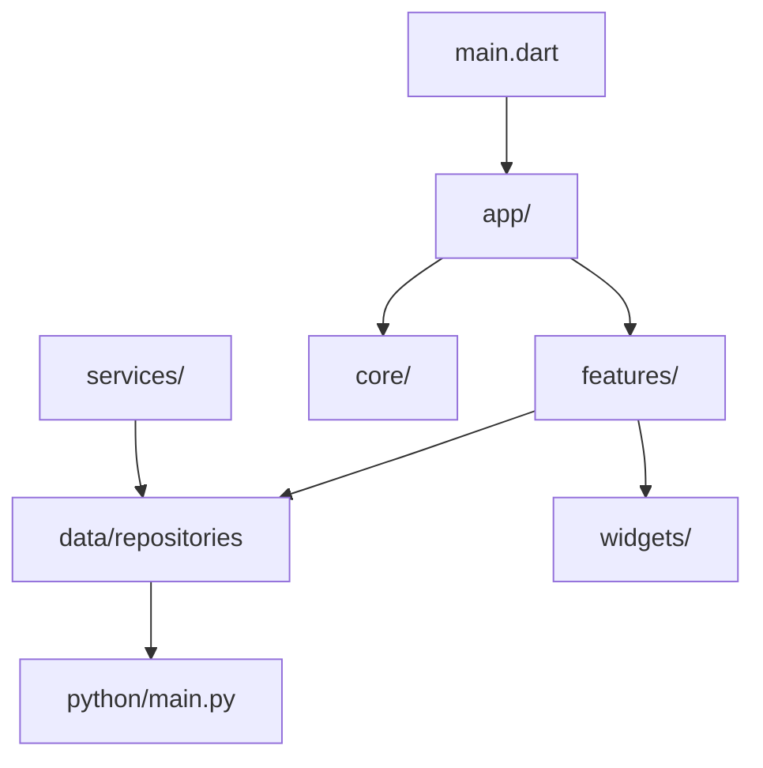
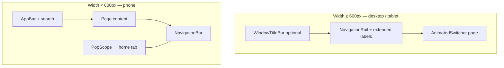
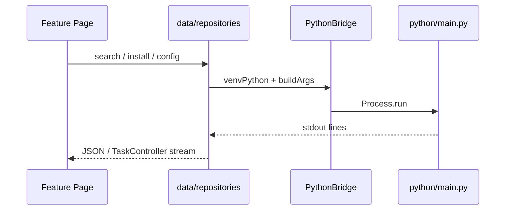

# OmniStore Project Architecture

> **Maintain this file** when you change repo layout, navigation, or cross-process protocols.  
> Flutter details: [`FlutterUI/ARCHITECTURE.md`](FlutterUI/ARCHITECTURE.md)

---

## 1. Repository overview

| Directory | Technology | Responsibility |
|-----------|------------|----------------|
| `FlutterUI/` | Dart / Flutter | MD3 UI, navigation, tray, GitHub stars (HTTP) |
| `python/` | Python | Package search/install, sources, AI CLI |
| `daemon/` | Rust | Background update checks, desktop notifications |
| `plugins/` | Python | Userdropped `UnifiedSource` plugins |

**TODOs for Repository Overview:**
- [TODO 1]: Unify build scripts (currently `auto_build.py`). Consider a Makefile or Justfile for orchestrating Flutter, Python, and Rust builds.
- [TODO 2]: Define a strict versioning scheme across all three components (Flutter, Python, Rust) to ensure compatibility in releases.
- [TODO 3]: Create a shared constants file or schema registry (e.g., Protocol Buffers or shared JSON schema) so Python and Dart agree on IPC data structures.
- [TODO 4]: Add integration test harnesses spanning the whole repo (spinning up UI, python backend, and daemon together).

---

## 2. FlutterUI layout (current)

### 2.1 Layered `lib/`

| Layer | Path | Notes |
|-------|------|-------|
| Entry | `lib/main.dart` | Calls `bootstrapOmniStore()` only |
| App shell | `lib/app/` | Providers, `MaterialApp`, `MainNavigationEntry` |
| Features | `lib/features/` | Feature-first `presentation/pages` + `controllers` |
| Core | `lib/core/` | Theme, adaptive shell, GitHub client, desktop window |
| Data bridge | `lib/data/` | **`PythonBridge` + repositories** (not `python/`) |
| Services | `lib/services/` | `BackendService`, `TaskManager`, `UpdateService` |

**Renamed (clarity):** `lib/backend/` → `lib/data/`, `BackendConstants` → `PythonBridge`.

**TODOs for FlutterUI Layout:**
- [x] [TODO 5]: Completely delete the legacy `FlutterUI/lib/backend/` directory which causes duplication (e.g., `ai_repository.dart` exists in both places).
- [x] [TODO 6]: Audit all imports in `features/` to ensure no files are still importing from `lib/backend/`.
- [TODO 7]: Extract navigation logic from UI components into a dedicated declarative router (e.g., GoRouter) for deep linking support.
- [TODO 8]: Enforce strict boundaries between `features` so they communicate via `services` or `core` rather than importing each other's pages directly.

### 2.2 Feature modules

| Module | Location | Screens |
|--------|----------|---------|
| Home | `features/home/` | Explore landing |
| Explore | `features/explore/presentation/` | Category, Search, Details, GitHub/Flatpak stores |
| Apps | `features/apps/` | Installed list |
| Settings | `features/settings/presentation/` | `TweaksPage`, `SettingsController` |
| Task manager | `features/task_manager/presentation/` | Downloads, `TaskController` |
| Onboarding | `features/onboarding/` | `WelcomePage` |

**TODOs for Feature Modules:**
- [TODO 9]: Decouple `TaskController` from `TaskManager` service to follow pure MVVM/Riverpod state isolation.
- [TODO 10]: Refactor `SettingsController` to batch configuration updates instead of writing to disk on every keystroke.
- [x] [TODO 11]: Move hardcoded strings in `WelcomePage` and other feature pages to `AppLocalizations` (ARB files).

### 2.3 UI shell (responsive)

- Implementation: `core/layout/adaptive_navigation_shell.dart`
- State: `core/navigation_controller.dart` (tab indices 0–7, see `FlutterUI/ARCHITECTURE.md`)
- Desktop: `core/platform/desktop_window_service.dart` — min size 900×640, tray minimize, hidden title bar
- GitHub stars: `core/network/github_client.dart` + `widgets/github_star_badge.dart`

**TODOs for UI Shell:**
- [TODO 12]: Implement a proper Split-View layout for tablet/desktop (e.g., list on left, details on right) instead of just expanding the content width.
- [TODO 13]: Add comprehensive `Skeleton` loaders for all async page transitions to prevent UI jank.
- [TODO 14]: Ensure keyboard navigation (Tab-key focus rings) works properly across the adaptive navigation rail and content areas.

---

## 3. Python backend (`python/`)

- **Entry:** `python/main.py` — CLI router, JSON/`[PROGRESS]` streams to Flutter
- **`source/`:** Dynamic plugins (Pacman, AUR, Flatpak, AppImage, GitHub) implementing `BaseSource`
- **`core/`:** Controllers (`source_manager.py`), Recommendation Manager, and Base Source definitions.
- **`core/modules/`:** Modularized utilities (`downloader/`, `env_manager.py`, `cache_manager.py`, etc.)
- **`core/ai/`:** Ollama, Gemini, OpenAI-compatible providers

Flutter invokes via `data/repositories/*` → `PythonBridge.venvPython` + `buildArgs()`.

**TODOs for Python Backend:**
- [x] [TODO 15]: Merge `python/core/search/` and `python/core/sources/`. Currently, package managers like `pacman`, `flatpak`, and `aur` have scattered logic across both directories.
- [TODO 16]: Introduce a formalized Dependency Injection container for managers (`UpdateManager`, `InstallExecutor`) to ease testing.
- [TODO 17]: Standardize the `UnifiedSource` interface to explicitly handle async operations natively rather than wrapping blocking calls.
- [TODO 18]: Implement an SQLite database for `RecommendationManager` caching instead of raw JSON files to prevent concurrent write corruption.
- [TODO 19]: Add strict schema validation (e.g., Pydantic) for all CLI arguments passed from Flutter.
- [TODO 20]: Refactor `downloader/downloader.py` to support resumable downloads for large files (e.g., Flatpaks).

---

## 4. Rust daemon (`daemon/`)

Lightweight service: periodic update checks and system notifications. Stopped on full app exit (`pkill omnistore-daemon` in `MainNavigationEntry`).

**TODOs for Rust Daemon:**
- [TODO 21]: Change daemon lifecycle management. Instead of `pkill`, implement a graceful shutdown signal via Unix Domain Sockets or IPC.
- [TODO 22]: Add robust error recovery. If the daemon crashes, Flutter should detect this and attempt a restart.
- [TODO 23]: Move interval configuration logic so it dynamically updates when a user changes settings in the Flutter UI, without requiring a daemon restart.
- [TODO 24]: Ensure the daemon properly drops privileges if run with elevated permissions.

---

## 5. Integration flow

1. **Dev:** `python/.venv/bin/python` + `python/main.py`
2. **Release:** `backends/python_server` next to Flutter binary
3. **Streaming:** `[PROGRESS]`, `[SPEED]`, `[CALLBACK]` parsed in `BackendService` / `TaskManager`
4. **Tray:** `UpdateService` + `system_tray`; close → hide or full exit

**TODOs for Integration Flow:**
- [TODO 25]: Replace stdout text parsing with a dedicated local socket (Unix Domain Socket or localhost TCP) to prevent stdout corruption from unexpected Python errors.
- [TODO 26]: Add explicit timeout handling in Flutter for all CLI calls; if Python hangs, Flutter should fail gracefully.
- [TODO 27]: Implement a heartbeat mechanism between Flutter and Python to detect frozen subprocesses.
- [TODO 28]: Isolate Python `stderr` from `stdout`. Flutter should log `stderr` to a debug file rather than attempting to parse it as JSON.

---

## 6. Stream protocol (Python → Flutter)

| Token | Meaning |
|-------|---------|
| `[PROGRESS] <int>` | 0–100 progress; `-1` indeterminate |
| `[SPEED] <string>` | Download speed label |
| `[CALLBACK] <json>` | Terminal log `{type, message, level}` |

**TODOs for Stream Protocol:**
- [TODO 29]: Convert stream protocol to a pure JSON-RPC over stdout/stdin format to avoid regex token parsing.
- [TODO 30]: Add sequence IDs to requests and responses to allow concurrent CLI tasks to be multiplexed over a single persistent Python process.
- [TODO 31]: Define standardized error codes in `[CALLBACK]` json to distinguish between network failures, missing dependencies, and authentication errors.

---

## 7. Plugins

Drop `.py` plugins under `plugins/` subclassing `UnifiedSource` — auto-registered in search/install pipeline.

**TODOs for Plugins:**
- [TODO 32]: Implement sandbox restrictions (e.g., using `ast` or `seccomp`) for Python plugins to prevent malicious code execution.
- [TODO 33]: Add a Plugin verification signature check before loading `UnifiedSource` extensions.

---

## 8. Build (`auto_build.py`)

- Rust → `omnistore-daemon`
- PyInstaller → `python_server` in `backends/`
- Flutter release bundle
- `python auto_build.py --all`

**TODOs for Build System:**
- [TODO 34]: Migrate away from PyInstaller to a lighter embedded Python runtime (like PyOxidizer) for faster startup times.
- [TODO 35]: Setup GitHub Actions workflows to auto-build for Linux, Windows, and macOS on every commit.

---

## 9. UX pillars (summary)

1. Onboarding — `WelcomePage`, first-run config  
2. Navigation — adaptive shell, fluid `AnimatedSwitcher`  
3. Discovery — shelves, Hero banners, empty states  
4. Lifecycle — `TaskManager`, terminal dialog  
5. Configuration — grouped settings, stable text controllers  
6. AI — `MagicPulseIcon`, `isAIEnabled` gate  
7. Resilience — timeouts, stale GitHub cache, no red-screen on network errors  

**TODOs for UX Pillars:**
- [TODO 36]: Conduct accessibility audits to ensure `Semantics` widgets cover all custom buttons and icons.
- [x] [TODO 37]: Add localized tooltips to all icon-only buttons (especially in the `AdaptiveNavigationShell`).

---

## 10. Changelog (architecture)

| Date | Change |
|------|--------|
| 2026-06 | Feature-first `features/explore/presentation/`; removed `package_browse/` |
| 2026-06 | `lib/backend/` → `lib/data/`; `PythonBridge`; `lib/app/` shell split |
| 2026-06 | `AdaptiveNavigationShell`, `GitHubClient`, `OmnistoreTheme` |
| 2026-06 | Added Technical Debt TODOs across architecture for upcoming refactoring |
