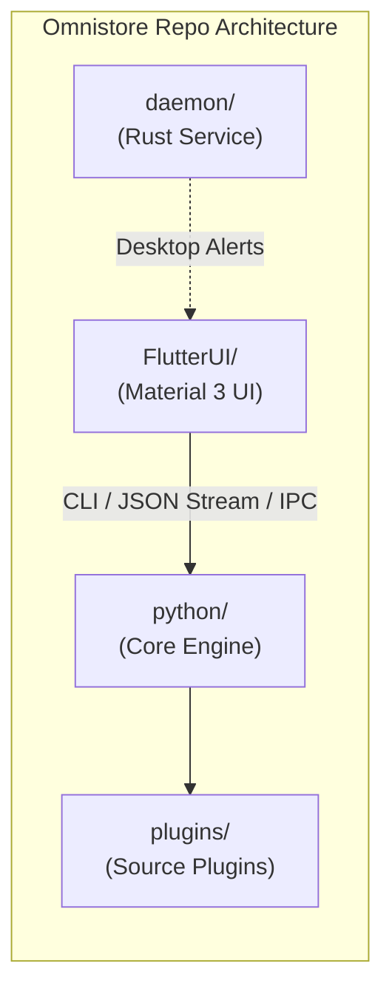

# OmniStore Project Architecture (全栈架构与全流程连线规范)

> **Maintain this file** when you change repo layout, navigation, feature connections, or cross-process protocols.  
> Flutter details: [`FlutterUI/ARCHITECTURE.md`](FlutterUI/ARCHITECTURE.md)

---

## 1. Repository Overview


```mermaid
flowchart LR
  subgraph repo["Omnistore Repo Architecture"]
    UI["FlutterUI/<br>(Material 3 UI)"]
    PY["python/<br>(Core Engine)"]
    DAEMON["daemon/<br>(Rust Service)"]
    PLUG["plugins/<br>(Source Plugins)"]
  end

  UI -->|"CLI / JSON Stream / IPC"| PY
  DAEMON -.->|"Desktop Alerts"| UI
  PY --> PLUG
```

| Directory | Technology | Responsibility |
|-----------|------------|----------------|
| `FlutterUI/` | Dart / Flutter | MD3 UI, navigation, tray, search, downloads, settings, AI dialogs |
| `python/` | Python / asyncio | Package search/install/uninstall, AUR PKGBUILD reviewer, AI assistant, storage clean |
| `daemon/` | Rust | Background update checks, system notifications |
| `plugins/` | Python / JSON | Dynamic `UnifiedSource` plugins & metadata manifests (`plugins/sources/*/plugin.json`) |

---

## 2. Feature Connectivity & Inter-Module Communication (全功能连线拓扑)

```mermaid
flowchart TD
    subgraph Flutter_UI ["FlutterUI 前端 (lib/)"]
        NavShell["AdaptiveNavigationShell (app/main_navigation.dart)"]
        HomePage["首页/推荐 (features/home/home_page.dart)"]
        SearchPage["搜索/多源预加载 (features/explore/presentation/pages/search_page.dart)"]
        AppDetails["应用详情 Sheet & AI预检 (features/explore/presentation/pages/details_page.dart)"]
        PKGBUILDReview["AUR PKGBUILD 审核对话框 (features/explore/presentation/widgets/pkgbuild_dialog.dart)"]
        AppsPage["已安装应用 (features/apps/apps_page.dart)"]
        DownloadPage["下载/任务日志/AI错误诊断 (features/task_manager/presentation/pages/download_page.dart)"]
        StorageSection["存储/系统清理 (features/settings/presentation/widgets/storage_cleanup_card.dart)"]
        SettingsPage["设置/源配置/跳过PKGBUILD审阅 (features/settings/presentation/pages/settings_page.dart)"]
        
        BackendSvc["BackendService (services/backend_service.dart)"]
    end

    subgraph IPC_Bridge ["Python Bridge & IPC Layer"]
        Bridge["PythonBridge (data/python_bridge.dart)"]
        DaemonIPC["DaemonIPCService (services/backend/daemon_ipc_service.dart)"]
    end

    subgraph Python_Engine ["Python Backend (python/core/)"]
        BackendFacade["OmnistoreBackend (backend.py)"]
        PKGBUILDManager["PKGBUILD Fetcher (sources/aur/aur.py)"]
        AIAssistant["AIAssistant (ai/assistant.py)"]
        StorageCleaner["StorageCleaner (backend.py)"]
        PluginReg["PluginRegistry (sources/plugin_registry.py)"]
        InstallExec["InstallExecutor & LockGuard (downloader/manager.py)"]
    end

    NavShell --> HomePage
    NavShell --> SearchPage
    NavShell --> AppsPage
    NavShell --> DownloadPage
    NavShell --> SettingsPage

    HomePage -->|预加载富卡片 & AI推荐| BackendSvc
    SearchPage -->|聚合搜索 & Variants合并| BackendSvc
    AppDetails -->|AI 安装风险预检| BackendSvc
    AppDetails -->|安装 AUR 包 (检查 PKGBUILD 审阅设置)| PKGBUILDReview
    PKGBUILDReview -->|确认安装| BackendSvc
    DownloadPage -->|错误日志一键 AI 诊断| BackendSvc
    StorageSection -->|存储状态 & 一键垃圾清理| BackendSvc
    SettingsPage -->|切换跳过 PKGBUILD 审核 / 源开关| BackendSvc

    BackendSvc --> Bridge
    BackendSvc --> DaemonIPC

    Bridge --> BackendFacade
    DaemonIPC --> BackendFacade

    BackendFacade --> PKGBUILDManager
    BackendFacade --> AIAssistant
    BackendFacade --> StorageCleaner
    BackendFacade --> PluginReg
    BackendFacade --> InstallExec
```

---

## 3. Key Architectural Touchpoints & Logic Design

### 3.1 AUR PKGBUILD Review Flow (Paru / Yay Style)
- **PKGBUILD Fetching**: Backend fetches the exact PKGBUILD text from AUR RPC / cgit (`https://aur.archlinux.org/cgit/aur.git/plain/PKGBUILD?h=<name>`).
- **Interactive Review**: When installing an AUR package, Flutter UI checks setting `skip_pkgbuild_review`.
  - If `false` (default): Opens `PKGBUILDReviewDialog` with code syntax view, "Confirm Install", and "Cancel".
  - If `true`: Skips the review dialog and proceeds directly with installation.
- **Config Toggle**: Accessible in Settings -> Software Sources -> "Skip AUR PKGBUILD review".

### 3.2 AI API Touchpoints Across Features
1. **AI Natural Language Intent Search**: Search bar accepts natural language queries, routed to `ai_cli` / `--ai-cli`.
2. **AI App Summary**: App detail sheet loads AI summary (`ai_summary` / `run_ai_summary`).
3. **AI Preflight Risk Decision**: Evaluates multi-source risks (`ai_install_decision` / `run_ai_install_decision`).
4. **AI Error Diagnostics**: Task logs view includes "AI Analyze Error" button invoking `ai_analyze_error`.
5. **AI Health Report**: Settings -> Health section presents AI system health assessment (`ai_health`).

### 3.3 System Cleanup & Storage Space Management
- **Storage Info**: `run_get_storage_info()` retrieves total, used, and free disk space.
- **System Cleanup**: `clean_system()` cleans Pacman package cache (`pacman -Sc`), orphaned packages (`pacman -Rns $(pacman -Qtdq)`), unused Flatpak runtimes, and download temps.

### 3.4 Rich App Card Preloading
- Search results & recommendation cards preload complete metadata:
  - App Name, Icon/Avatar URL, Description, Version, Installed Status, Disk Size.
  - **All Available Variants** (Pacman, AUR, Flatpak, AppImage, GitHub, Bitu, etc.) rendered with source badges.

---

## 4. File Layout & Code Hygiene Standards

### 4.1 Python Backend Structure (`python/core/`)
```
python/core/
├── ai/                      # AI assistant & providers (Ollama, OpenAI)
├── downloader/              # InstallExecutor, state locks, AppImage downloader
├── search/                  # Scoring & custom repository management
├── sources/                 # UnifiedSource implementations & PluginRegistry
│   ├── appimage/
│   ├── aur/                 # Includes PKGBUILD fetch logic
│   ├── flatpak/
│   ├── pacman/
│   ├── github/
│   ├── bitu/
│   └── external.py
├── backend.py               # Main OmnistoreBackend facade
├── cli_handler.py           # CLI argument parsing & validation
├── config_loader.py         # Schema-validated YAML configuration
└── security_validator.py    # Strict boundary defense & sanitization
```

### 4.2 FlutterUI Structure (`FlutterUI/lib/`)
```
FlutterUI/lib/
├── app/                     # App bootstrap & main navigation shell
├── core/                    # Adaptive shell, theme, window, widgets
├── data/                    # PythonBridge & repositories
│   └── repositories/
├── features/                # Feature-first presentation & controllers
│   ├── apps/
│   ├── explore/
│   ├── home/
│   ├── settings/
│   └── task_manager/
├── models/                  # Data models (AppPackage, AppVariant, etc.)
└── services/                # BackendService, UpdateService, TaskManager
```

---

## 5. Changelog (Architecture)

| Date | Change |
|------|--------|
| 2026-07 | Integrated CachyOS `db.lck` safety check & Shelly-ALPM multi-source update flow |
| 2026-07 | Fixed `SecurityValidator` Unicode/Chinese path & string sanitization |
| 2026-07 | Added AUR PKGBUILD interactive review dialog and `skip_pkgbuild_review` setting |
| 2026-07 | Embedded AI API touchpoints (Preflight, Summary, Error Analysis, System Health) |
| 2026-07 | Connected Storage Space Info & System Cleanup features |
